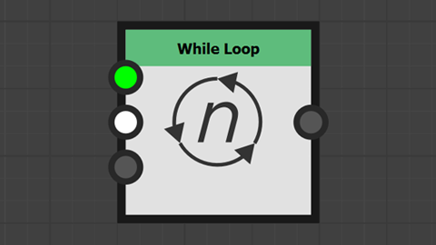

<!--Entry format-->
<!--
# Section name|Section description
Element description

[more](link text|icon|url)
-->

# Praktische Tutorials|Anleitungen in kleinteiligen Schritten zu den neuesten Funktionen von Substance 3D Designer...
Streuung auf Splines und Pfaden

[more](Im Webbrowser ansehen|video|https://www.adobe.com/go/designer-tutorial-scattering)

# Praktische Tutorials|Anleitungen in kleinteiligen Schritten zu den neuesten Funktionen von Substance 3D Designer...
Splines-Knoten

[more](Im Webbrowser ansehen|video|https://www.adobe.com/go/designer-tutorial-splines)

# Praktische Tutorials|Anleitungen in kleinteiligen Schritten zu den neuesten Funktionen von Substance 3D Designer...
Pfadknoten

[more](Im Webbrowser ansehen|video|https://www.adobe.com/go/designer-tutorial-paths)

# Praktische Tutorials|Anleitungen in kleinteiligen Schritten zu den neuesten Funktionen von Substance 3D Designer...
Portalknoten

[more](Im Webbrowser ansehen|video|https://www.adobe.com/go/designer-tutorial-portals)

# Praktische Tutorials|Anleitungen in kleinteiligen Schritten zu den neuesten Funktionen von Substance 3D Designer...
Während-Schleifen

[more](Im Webbrowser ansehen|video|https://www.adobe.com/go/designer-tutorial-loops)

# Weitere Ressourcen|Erweitern Sie Ihre Kenntnisse oder finden Sie Antworten auf Ihre Fragen...
Erste Schritte in Designer

[more](In Webbrowser öffnen|webpages|https://www.adobe.com/go/designer-main-tutorials)

# Weitere Ressourcen|Erweitern Sie Ihre Kenntnisse oder finden Sie Antworten auf Ihre Fragen...
Schnelltipps

[more](In Webbrowser öffnen|webpages|https://www.adobe.com/go/designer-quicktips)

# Weitere Ressourcen|Erweitern Sie Ihre Kenntnisse oder finden Sie Antworten auf Ihre Fragen...
Onlinedokumentation

[more](In Webbrowser öffnen|webpages|https://www.adobe.com/go/Substance-3D-doc-Designer)