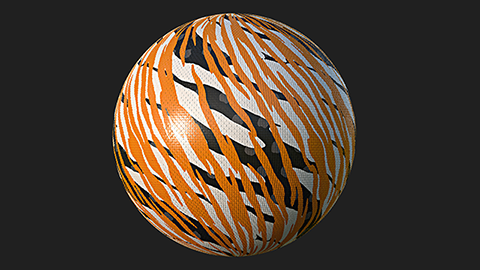
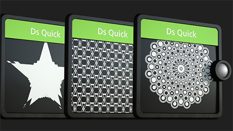

<!--Entry format-->
<!--
# Section name|Section description
Element description

[more](link text|icon|url)
-->

# Tutoriels pratiques|Suivez les instructions étape par étape pour découvrir les dernières fonctionnalités de Substance 3D Designer…
Distribuer sur les splines et les paths

[more](Regarder dans un navigateur web|video|https://www.adobe.com/go/designer-tutorial-scattering)

# Tutoriels pratiques|Suivez les instructions étape par étape pour découvrir les dernières fonctionnalités de Substance 3D Designer…
Nœuds de splines

[more](Regarder dans un navigateur web|video|https://www.adobe.com/go/designer-tutorial-splines)

# Tutoriels pratiques|Suivez les instructions étape par étape pour découvrir les dernières fonctionnalités de Substance 3D Designer…
Nœud Path

[more](Regarder dans un navigateur web|video|https://www.adobe.com/go/designer-tutorial-paths)

# Tutoriels pratiques|Suivez les instructions étape par étape pour découvrir les dernières fonctionnalités de Substance 3D Designer…
Nœud de portail

[more](Regarder dans un navigateur web|video|https://www.adobe.com/go/designer-tutorial-portals)

# Tutoriels pratiques|Suivez les instructions étape par étape pour découvrir les dernières fonctionnalités de Substance 3D Designer…
Boucles While

[more](Regarder dans un navigateur web|video|https://www.adobe.com/go/designer-tutorial-loops)

# Autres ressources|Développez vos connaissances ou trouvez les réponses à vos questions…
Premiers pas dans Designer

[more](Ouvrir dans un navigateur web|webpages|https://www.adobe.com/go/designer-main-tutorials)

# Autres ressources|Développez vos connaissances ou trouvez les réponses à vos questions…
Conseils rapides

[more](Ouvrir dans un navigateur web|webpages|https://www.adobe.com/go/designer-quicktips)

# Autres ressources|Développez vos connaissances ou trouvez les réponses à vos questions…
Documentation en ligne

[more](Ouvrir dans un navigateur web|webpages|https://www.adobe.com/go/Substance-3D-doc-Designer)