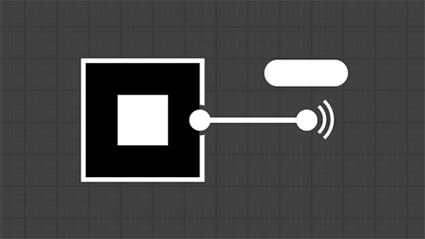

<!--Entry format-->
<!--
# Section name|Section description
Element description

[more](link text|icon|url)
-->

# Tutoriais práticos|Siga a orientação passo a passo para aprender os recursos mais recentes do Substance 3D Designer...
Dispersão em linhas flexíveis e caminhos

[more](Assistir no navegador|video|https://www.adobe.com/go/designer-tutorial-scattering)

# Tutoriais práticos|Siga a orientação passo a passo para aprender os recursos mais recentes do Substance 3D Designer...
Nós Spline

[more](Assistir no navegador|video|https://www.adobe.com/go/designer-tutorial-splines)

# Tutoriais práticos|Siga a orientação passo a passo para aprender os recursos mais recentes do Substance 3D Designer...
Nó de caminhos

[more](Assistir no navegador|video|https://www.adobe.com/go/designer-tutorial-paths)

# Tutoriais práticos|Siga a orientação passo a passo para aprender os recursos mais recentes do Substance 3D Designer...
Nó do portal

[more](Assistir no navegador|video|https://www.adobe.com/go/designer-tutorial-portals)

# Tutoriais práticos|Siga a orientação passo a passo para aprender os recursos mais recentes do Substance 3D Designer...
Enquanto faz um laço

[more](Assistir no navegador|video|https://www.adobe.com/go/designer-tutorial-loops)

# Mais recursos|Desenvolva seu conhecimento ou encontre respostas para suas perguntas...
Primeiros passos no Designer

[more](Abrir no navegador|webpages|https://www.adobe.com/go/designer-main-tutorials)

# Mais recursos|Desenvolva seu conhecimento ou encontre respostas para suas perguntas...
Dicas rápidas

[more](Abrir no navegador|webpages|https://www.adobe.com/go/designer-quicktips)

# Mais recursos|Desenvolva seu conhecimento ou encontre respostas para suas perguntas...
Documentação online

[more](Abrir no navegador|webpages|https://www.adobe.com/go/Substance-3D-doc-Designer_br)