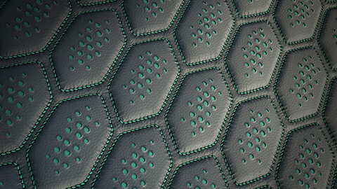
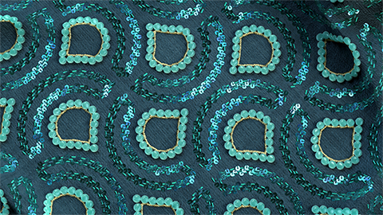
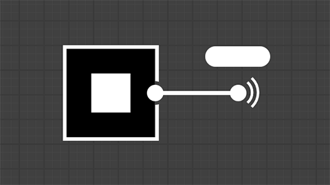
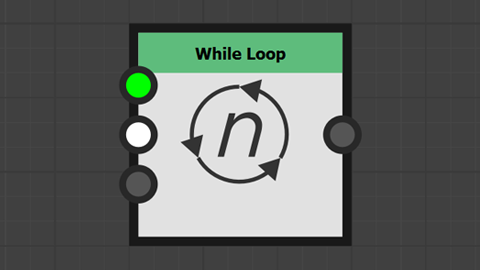
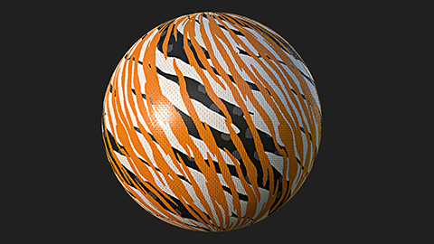
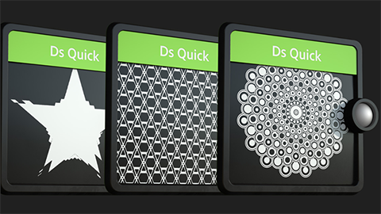
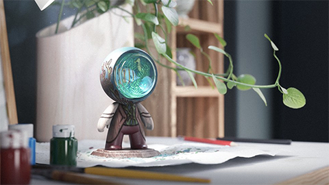

<!--Entry format-->
<!--
# Section name|Section description
Element description

[more](link text|icon|url)
-->

# 实操教程|按照分步指导来学习 Substance 3D Designer 的最新功能...
散射在样条曲线和路径上

[more](在 Web 浏览器中观看|video|https://www.adobe.com/go/designer-tutorial-scattering)

# 实操教程|按照分步指导来学习 Substance 3D Designer 的最新功能...
样条曲线节点

[more](在 Web 浏览器中观看|video|https://www.adobe.com/go/designer-tutorial-splines)

# 实操教程|按照分步指导来学习 Substance 3D Designer 的最新功能...
路径节点

[more](在 Web 浏览器中观看|video|https://www.adobe.com/go/designer-tutorial-paths)

# 实操教程|按照分步指导来学习 Substance 3D Designer 的最新功能...
门户节点

[more](在 Web 浏览器中观看|video|https://www.adobe.com/go/designer-tutorial-portals)

# 实操教程|按照分步指导来学习 Substance 3D Designer 的最新功能...
当型循环

[more](在 Web 浏览器中观看|video|https://www.adobe.com/go/designer-tutorial-loops)

# 更多资源|拓展您的知识或查找问题的答案...
Designer 中的初始步骤

[more](在 Web 浏览器中打开|webpages|https://www.adobe.com/go/designer-main-tutorials)

# 更多资源|拓展您的知识或查找问题的答案...
快速提示

[more](在 Web 浏览器中打开|webpages|https://www.adobe.com/go/designer-quicktips)

# 更多资源|拓展您的知识或查找问题的答案...
在线文档

[more](在 Web 浏览器中打开|webpages|https://www.adobe.com/go/Substance-3D-doc-Designer)