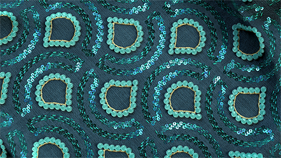

<!--Entry format-->
<!--
# Section name|Section description
Element description

[more](link text|icon|url)
-->

# _üHands-on tutorials|_üFollow step by step guidance to learn latest features of Substance 3D Designer...
_üScattering on Splines and Paths

[more](_üWatch in web browser|video|_ühttps://www.adobe.com/go/designer-tutorial-scattering)

# _üHands-on tutorials|_üFollow step by step guidance to learn latest features of Substance 3D Designer...
_üSplines nodes

[more](_üWatch in web browser|video|_ühttps://www.adobe.com/go/designer-tutorial-splines)

# _üHands-on tutorials|_üFollow step by step guidance to learn latest features of Substance 3D Designer...
_üPaths node

[more](_üWatch in web browser|video|_ühttps://www.adobe.com/go/designer-tutorial-paths)

# _üHands-on tutorials|_üFollow step by step guidance to learn latest features of Substance 3D Designer...
_üPortal node

[more](_üWatch in web browser|video|_ühttps://www.adobe.com/go/designer-tutorial-portals)

# _üHands-on tutorials|_üFollow step by step guidance to learn latest features of Substance 3D Designer...
_üWhile loops

[more](_üWatch in web browser|video|_ühttps://www.adobe.com/go/designer-tutorial-loops)

# _üMore resources|_üDevelop your knowledge or find answers to your questions...
_üFirst Steps in Designer

[more](_üOpen in web browser|webpages|_ühttps://www.adobe.com/go/designer-main-tutorials)

# _üMore resources|_üDevelop your knowledge or find answers to your questions...
_üQuicktips

[more](_üOpen in web browser|webpages|_ühttps://www.adobe.com/go/designer-quicktips)

# _üMore resources|_üDevelop your knowledge or find answers to your questions...
_üOnline Documentation

[more](_üOpen in web browser|webpages|_ühttps://www.adobe.com/go/Substance-3D-doc-Designer)