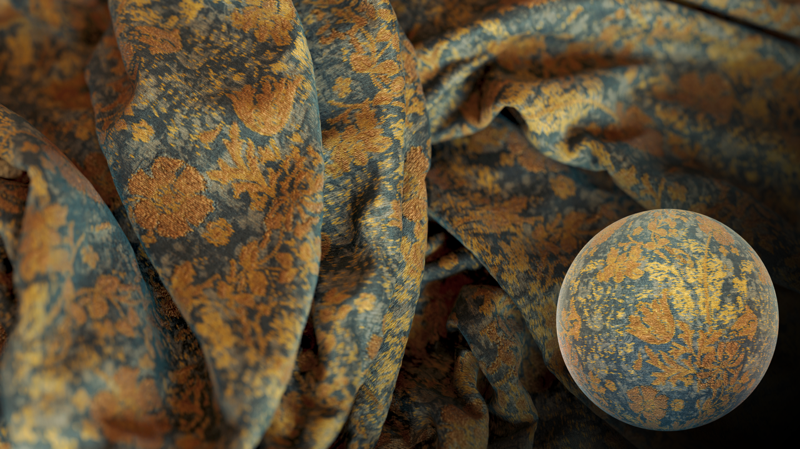
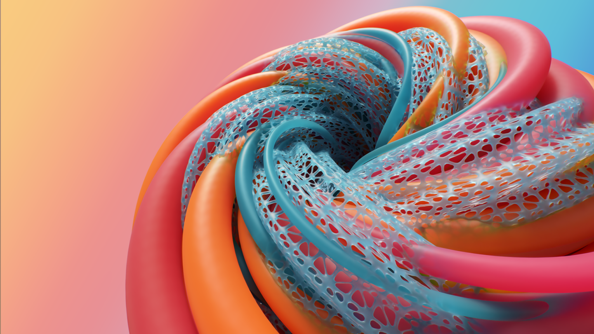
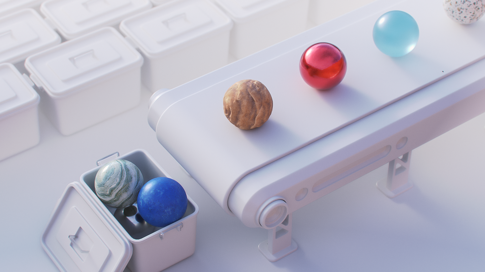
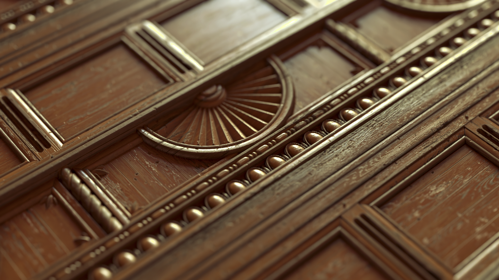

# Eine vernetzte 3D-Design-Lösung
Adobe Substance 3D Designer ermöglicht es Ihnen, Materialien mit vollständiger Kontrolle zu erstellen. Es ist Teil eines Anwendungs- und Content-Ökosystems, das es Ihnen ermöglicht, alles in 3D zu gestalten.

[more](https://www.adobe.com/go/substance-3d-ccd-banner_de)

# Prozedurale Generierung
Erstellen Sie prozedurale Materialien und Muster, Bildfilter und Umgebungslichter. Verbinden Sie Knoten, um endlose Variationen jedes Assets zu generieren, und verwenden Sie sie in anderen 3D-Tools.

# Ein vollständiges Material-Ökosystem
Ihre Designer-Kreationen sind mit praktisch jedem Workflow kompatibel. Die überwiegende Mehrheit der 3D-Anwendungen unterstützt Substance-Materialien, sodass Sie diese anpassen können, wo immer Sie möchten.

# Der Standard für 3D-Materialien
Substance 3D Designer ist ein knotenbasierter Editor. Sie können darin prozedurale Materialien nichtlinear und nicht-destruktiv erstellen und alle Parameter für Endbenutzer zur Bearbeitung freilegen.

