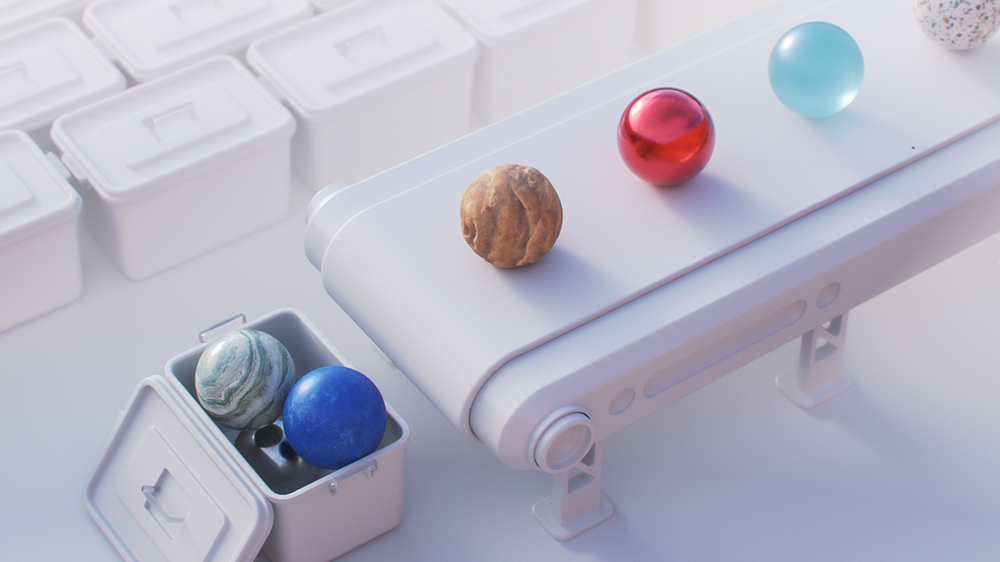

# Una solución de diseño 3D conectada
Adobe Substance 3D Designer le permite crear materiales con control completo. Es una parte de un ecosistema de aplicaciones y contenido que le permite diseñar todo en 3D.

[more](https://www.adobe.com/go/substance-3d-ccd-banner_es)

# Creación procedimental
Cree materiales y patrones de procedimiento, filtros de imagen y luces ambientales. Conecte nodos para generar variaciones infinitas en cada activo y abrirlos en otras herramientas 3D.

# Un ecosistema de materiales completo
Sus creaciones de Designer son compatibles con prácticamente cualquier flujo de trabajo. La gran mayoría de las aplicaciones 3D son compatibles con materiales de Substance para que pueda personalizarlos donde lo necesite.

# El estándar para materiales 3D
Substance 3D Designer es un editor basado en nodos. Le permite crear materiales procedimentales de manera no lineal y no destructiva, y exponer cualquier parámetro para que los usuarios finales los controlen.

