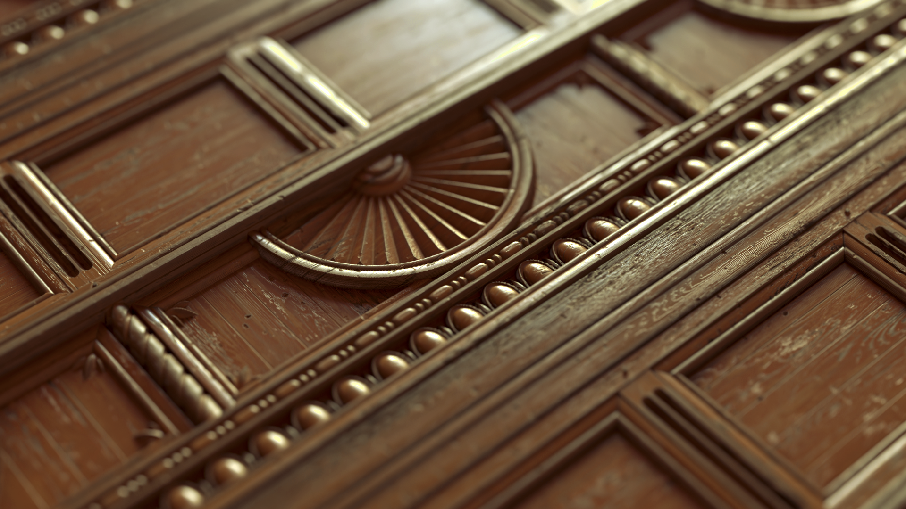

# Soluzione per la progettazione 3D connessa
Adobe Substance 3D Designer consente di creare materiali con assoluto controllo. Fa parte di un ecosistema di app e contenuti che consente di progettare tutto in 3D.

[more](https://www.adobe.com/go/substance-3d-ccd-banner_it)

# Creazione procedurale
Crea materiali e pattern procedurali, filtri per immagini e luci ambientali. Connetti i nodi per generare variazioni infinite su ogni risorsa e utilizzali in altri strumenti 3D.

# Un ecosistema di materiali completo
Le creazioni Designer sono compatibili praticamente con qualsiasi flusso di lavoro. La maggior parte delle app 3D supporta i materiali di Substance, così potrai personalizzarli ovunque ti servano.

# Lo standard per materiali 3D
Substance 3D Designer è un editor basato su nodi. Consente di creare materiali procedurali in modo non lineare e non distruttivo, e di esporre qualsiasi parametro che gli utenti finali possano controllare.

