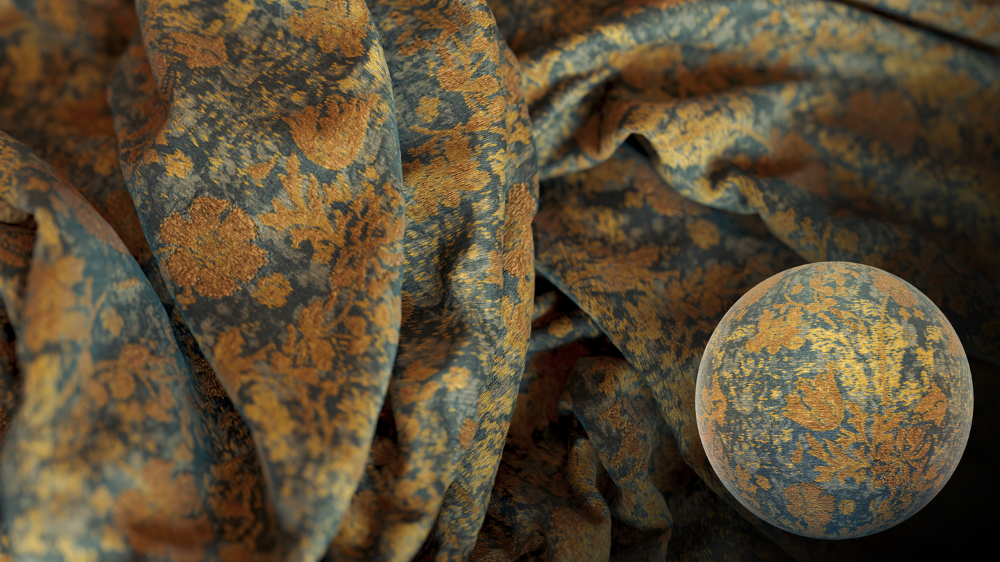
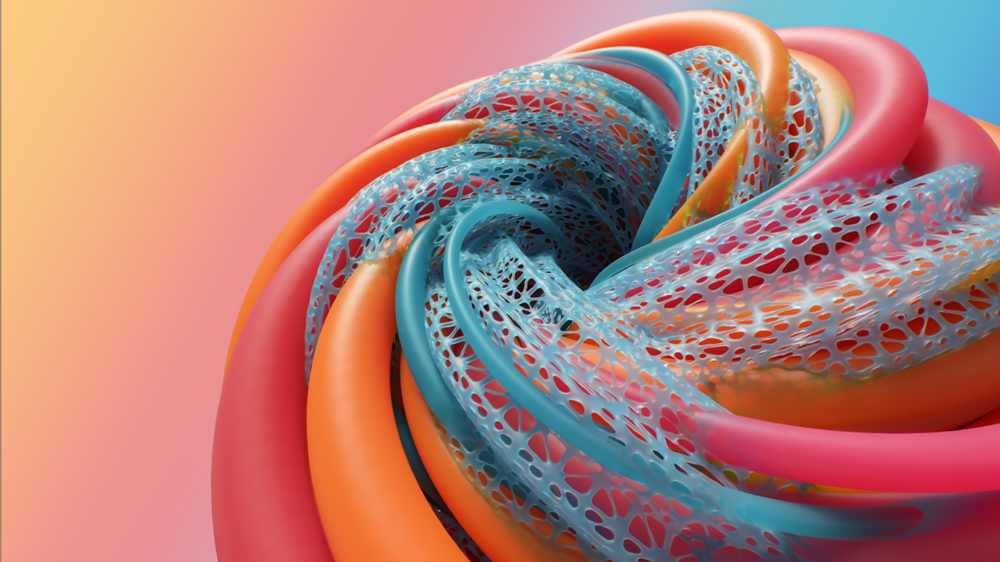

# 3D デザインソリューションの連携
Adobe Substance 3D Designer を使用すると、マテリアルを思いどおりに調整して作成することができます。
Adobe Substance 3D Designer は、アプリケーションとコンテンツのエコシステムの一部であり、あらゆるものを 3D でデザインできるようにします。

[more](https://www.adobe.com/go/substance-3d-ccd-banner_jp)

# プロシージャルの作成
プロシージャルなマテリアルとパターン、画像フィルター、環境光を作成します。ノードを接続して、すべてのアセットに様々なパターンのバリエーションを作成し、他の 3D ツールに取り込むことが可能です。

# 完全なマテリアルエコシステム
Designer で作成した作品は、ほぼすべてのワークフローと互換性があります。
ほとんどの 3D アプリは Substance マテリアルをサポートしているため、必要に応じてカスタマイズできます。

# 3D マテリアルの標準
Substance 3D Designer はノードベースのエディターです。
プロシージャルマテリアルを非線形かつ非破壊的な方法で作成することや、エンドユーザーが調整できる任意のパラメーターを表示することができます。

