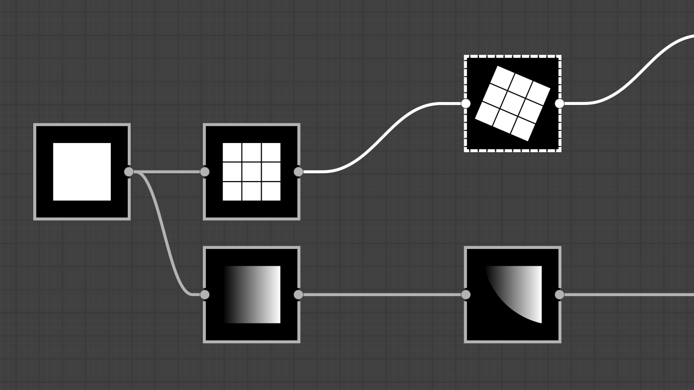

# Verbesserungen an Rahmen
Viele neue Werkzeuge für Rahmen: Automatische Anpassung der Rahmengröße an den Inhalt, Auto-Erweiterung von Rahmen beim Verschieben von Knoten mit der Umschalttaste und über HTML-Code formatierbarer Text in der Rahmenbeschreibung.
Einige weitere Verbesserungen an Zugehörigkeitsregeln, visuellem Stil usw. optimieren und vereinfachen die Nutzung von Rahmen weiter.

# Nutzungsfreundlichkeit
Knoten werden jetzt in der Mitte des sichtbaren Teils einer Verknüpfung erstellt, sodass neue Knoten immer sichtbar sind. Knoten werden nun außerdem einheitlich am Raster ausgerichtet.
Das Menü „Knoten“ wurde ebenfalls verbessert: Sie können die Ergebnisliste in einer Schleife abrufen, indem Sie zum Beispiel ganz oben den Pfeil nach oben drücken, um direkt zum letzten Element zu gelangen. Die Suche ist jetzt toleranter und findet auch Ergebnisse, die nicht 1:1 übereinstimmen.

# AxF-Export
Wenn Sie mit AxF-Dateien arbeiten, können Sie diese jetzt mit Designer bearbeiten. Laden Sie Ihre Datei, wenden Sie in Ihrem Substance-Graph Änderungen auf die Texturen an und exportieren Sie sie als neue Ebenen in die Originaldatei.

