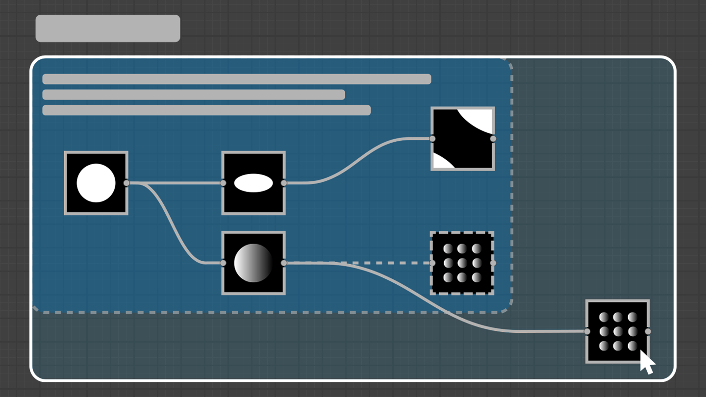

# Miglioramenti per le cornici
Molti nuovi strumenti per le cornici: regola automaticamente le dimensioni della cornice in base al contenuto, utilizza il tasto MAIUSC per espandere automaticamente la cornice mentre viene spostato un nodo e digita il codice HTML nella descrizione della cornice per formattare il testo.
Inoltre, l'uso delle cornici è stato migliorato e semplificato grazie a miglioramenti alle regole di appartenenza, allo stile grafico, ecc.

# Qualità della vita
I nodi vengono ora creati al centro della parte visibile di un collegamento in modo che i nuovi nodi siano sempre visibili. Inoltre, i nodi vengono ora allineati in modo coerente alla griglia.
Anche il menu Nodo è stato migliorato: è possibile eseguire il loop attraverso l'elenco dei risultati (ad esempio, premendo il tasto Freccia su puoi accedere direttamente all'ultimo elemento dell'elenco) e la ricerca è ora più tollerante e fornisce risultati anche quando il termine non corrisponde esattamente a quello che stai cercando.

# Esportazione AxF
Per chi lavora con i file AxF, ora è possibile utilizzare Designer per modificarli. Carica il file, applica le modifiche alle texture nel grafico Substance ed esportale come nuovo livello nel file originale.

