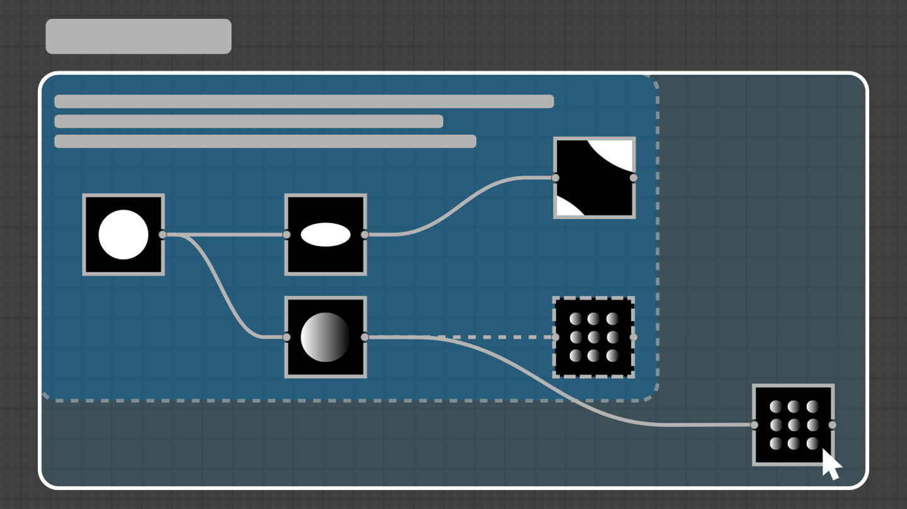
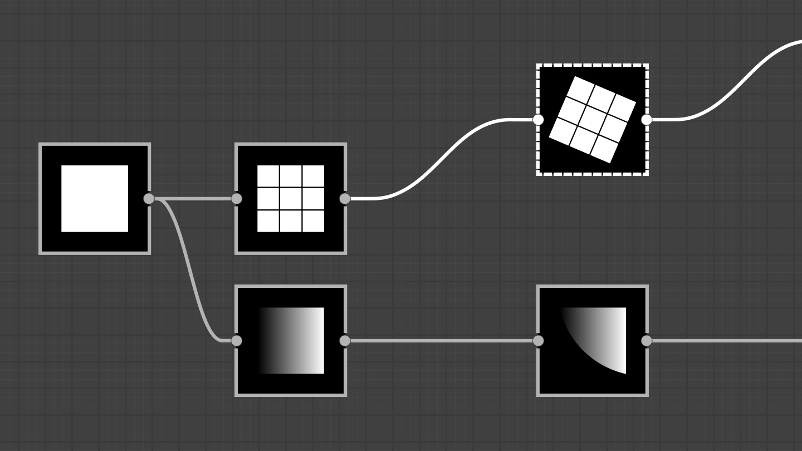
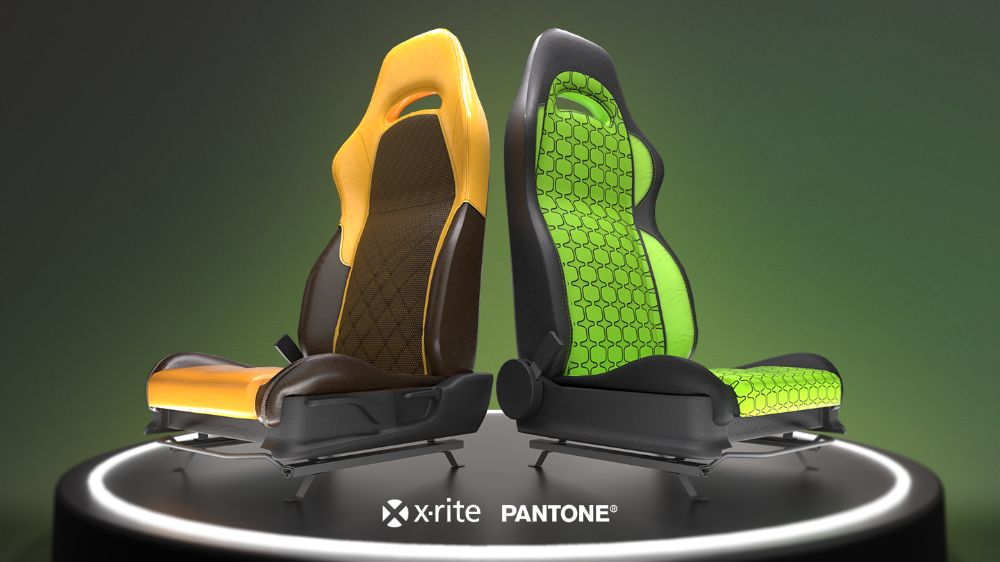

# _üFrames improvements
_üA lot of new tools for frames: automatically adjust the frame size to its content, use the SHIFT key to automatically expand the frame while moving a node, and type HTML code in the frame description to format text.
Using frames is also improved and simplified thanks to improvements to belonging rules, visual style, etc.

# _üQuality of life
_üNodes are now created on the middle of the visible part of a link, so new nodes are always visible. Moreover, nodes are now consistently aligned to the grid.
The node menu has also been improved: you can loop through the list of results (I.e., pressing the Up arrow key directly accesses the last element of the list) and search is now more forgiving and will provide results even when the search term is not a perfect match.

# _üAxF Export
_üFor those of you whom are working with AxF files, you can now use Designer to edit them. Load your file, apply changes to the textures in your Substance graph and export them as a new layer in the original file.

